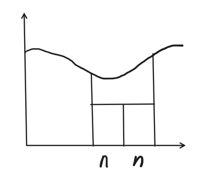

# Оглавление

1. [Лекция 1](#лекция-1)
2. [Лекция 2](#лекция-2)
3. [Лекция 3](#лекция-3)
4. [Лекция 4](#лекция-4)
5. [Лекция 5](#лекция-5)
6. [Потокобезопасные структуры данных](#потокобезопасные-структуры-данных)
7. [Неизменяемые объекты (Immutable)](#неизменяемые-объекты-immutable)
8. [Обработка данных в очередях](#обработка-данных-в-очередях)
9. [Синхронизированные алгоритмы](#синхронизированные-алгоритмы)
10. [Взаимное исключение в распределённых системах](#взаимное-исключение-в-распределённых-системах)
11. [Асинхронная разработка](#асинхронная-разработка)
12. [Ссылки](#ссылки)
---

Ниже приведён ваш **оригинальный текст** с небольшими дополнениями, **не меняя исходные формулировки**. Все добавленные сведения отмечены как «**Дополнение**».

---

# <a name="лекция-1"></a>Лекция 1

## Задача, стоящая перед нами

Взять Maven или Gradle, сделать простой проект, делающий что-то и тесты к нему. Задача должна быть вычислительно сложной. Время работы от 3 до 10 сек. Примеры: вычисление площади под графиком

**Дополнение**:  
*Для таких проектов часто удобно использовать плагины для автоматического тестирования и профилирования — например, Surefire и Jacoco в Maven, чтобы проверить корректность и производительность.*

---

## Параллельные вычисления и многопоточное программирование

**Параллельные вычисления** позволяют выполнять несколько задач одновременно, что сокращает общее время выполнения программы. **Многопоточное программирование** — это подход, при котором в рамках одного процесса создаются несколько потоков для выполнения различных задач.

Преимущества многопоточного программирования:
- Улучшение производительности на многопроцессорных системах.
- Реализация более отзывчивых программ (например, GUI).
- Эффективное использование ресурсов процессора.

Основные вызовы:
- Потокобезопасность.
- Сложность отладки.
- Переключение контекста, которое может увеличивать накладные расходы.

**Дополнение**:  
*В Java для безопасного доступа к разделяемым ресурсам используют синхронизированные блоки, объекты `Lock` (из пакета `java.util.concurrent.locks`), а также атомарные переменные (`AtomicInteger`, `AtomicLong` и др.).*

---

## Архитектура параллельных вычислительных систем

Современные вычислительные системы имеют архитектуры, оптимизированные для параллельных вычислений:
1. **Многоядерные процессоры**:
   - Несколько ядер в одном процессоре.
   - Поддерживают аппаратную многопоточность.
2. **Системы с разделяемой памятью**:
   - Общая память для всех процессоров.
   - Требуется синхронизация доступа.
3. **Распределенные системы**:
   - Несколько узлов соединены сетью.
   - Каждый узел имеет свою локальную память.
4. **Графические процессоры (GPU)**:
   - Оптимизированы для массово параллельных вычислений.
   - Используются в машинном обучении и компьютерной графике.
5. **Кластерные системы**:
   - Объединение множества серверов для работы как одного суперкомпьютера.
   - Используют MPI или другие протоколы для связи между узлами.

Архитектура выбирается в зависимости от типа задач и уровня параллелизма, который требуется достичь.

**Дополнение**:  
*Для некоторых типов задач (например, машинное обучение) удобнее использовать гибридные архитектуры, где сочетаются CPU и GPU (так называемые heterogeneous computing).*

---

# <a name="лекция-2"></a>Лекция 2

## Цель распараллеливания

Основная цель распараллеливания — это минимизация времени выполнения задач за счет их распределения на несколько процессоров или ядер. Это достигается путем:
- Разделения задач на независимые части.
- Одновременного выполнения нескольких частей задачи.

**Дополнение**:  
*При проектировании параллельного алгоритма важно учесть масштабируемость: как быстро увеличивается производительность при добавлении новых ядер/процессоров.*

---

## Минимум времени выполнения работ

Эффективное распараллеливание позволяет:
- Уменьшить общее время выполнения программы.
- Снизить задержки при выполнении долгих операций.
- Увеличить пропускную способность системы.

---
 - Статическое планирование - заранее продумываем план и реализацию.
 - Динамическое планирование - продумываем в процессе работы системы.
---

**Дополнение**:  
*При динамическом планировании можно использовать планировщики (schedulers) или средства типа «work-stealing» (в `ForkJoinPool`), чтобы равномернее распределять нагрузку.*

---

## Классификация ЭВМ

Классификация Флинна, основанная на том, как устроена в компьютере обработка данных. Согласно этой классификации все компьютеры (вычислительные комплексы) можно разделить на четыре класса - компьютеры с архитектурой:

- SISD (Single Instruction stream - Single Data stream) - одиночный поток команд - одиночный поток данных. К этому классу относятся обычные "последовательные" компьютеры с фон-Неймановской архитектурой, когда команды программы выполняются последовательно, обрабатывая очередной элемент данных.
- SIMD (Single Instruction stream - Multiple Data stream) - одиночный поток команд - множественный поток данных. К этому типу относятся компьютеры с векторными и матричными процессорами.
- MISD (Multiple Instruction stream - Single Data stream) - множественный поток команд - одиночный поток данных. К этому типу можно отнести компьютеры с конвейерным типом обработки данных. Однако, многие полагают, что такие компьютеры следует относить к первому типу, а компьютеры класса MISD пока не созданы.
- MIMD (Multiple Instruction stream - Multiple Data stream) - множественный поток команд - множественный поток данных. Класс MIMD чрезвычайно широк и в настоящее время в него попадают многие компьютеры достаточно разной архитектуры. Поэтому предлагаются другие классификации, позволяющие более точно классифицировать компьютеры, входящие в класс MIMD.

**Дополнение**:  
*В реальных системах MIMD часто сочетается с векторными инструкциями (SIMD), поэтому процессор может быть одновременно и «MIMD+SIMD».*

---

## Коэффициент полезной загрузки

Коэффициент полезной загрузки вычислительной системы показывает, насколько эффективно используются ресурсы. Высокий коэффициент достигается при равномерном распределении задач между всеми доступными ядрами/процессорами.


Критический путь 1 -> 5 -> 2 -> 3 -> 4.

$T_i$ - время выполнения одной задачи. $T_{oi} = \sum_{i=0}^{n} T_i$  - общее время выполнения для одного процесора

$T_{o1} = 5$, $T_{o2} = 4$

$\dfrac{T_{o1}}{T_{o2}} = 1,25$ - Ускорение

$K_з = \dfrac{4 + 1}{4 * 2} = \dfrac{5}{8} = 0, 625$ - коэффициент загрузки

**Дополнение**:  
*Иногда полезно анализировать граф зависимостей (DAG) задач, чтобы максимально эффективно распараллелить вычисления и увеличить коэффициент полезной загрузки.*

---

## Два уровня распараллеливания: по данным и по управлению

1. **Распараллеливание по данным**:
   - Задача разбивается на подзадачи, каждая из которых работает с отдельным набором данных.
   - Примеры: обработка массивов, параллельные вычисления в графике.
2. **Распараллеливание по управлению**:
   - Задача разбивается на подзадачи, каждая из которых выполняет свою логику.
   - Примеры: параллельная обработка запросов, многопоточная загрузка данных.

Эти два подхода могут сочетаться для достижения максимальной производительности.

**Дополнение**:  
*Часто распараллеливание по данным применяется при аналитических операциях над большими массивами (Big Data), а по управлению — в серверных приложениях, обрабатывающих множество независимых запросов.*

---

**Класс Thread** - поток в Java. Интерфейс `Runnable` - имеет метод `run()`.

**Thread** - получает объект `Runnable` и вызывает метод `run()`. Поток завершает работу, когда завершает работу метод `run()`.

Метод `start()` создает поток в ОС

**Дополнение**:  
*Создавать потоки напрямую удобно для простых сценариев. Для более сложных задач зачастую лучше использовать «thread pools», чтобы избежать постоянного создания новых потоков.*

---

# <a name="лекция-3"></a>Лекция 3

## Процессы: владелец ресурсов

**Процесс** в ОС — это выполняющаяся программа, обладающая собственным адресным пространством, открытыми файлами (дескрипторами), сетевыми соединениями и другими системными ресурсами. Процесс изолирован от других процессов для безопасности и стабильности системы.  

- В большинстве систем у каждого процесса есть **уникальный идентификатор процесса (PID)**.  
- Процесс может состоять из одного или нескольких **потоков**.  
- В отличие от потоков, процессы взаимодействуют друг с другом через механизмы межпроцессного взаимодействия (IPC) — сокеты, каналы, очереди сообщений и т.д.

Вся память, вычделенная во время работы процесса, принадлежит этому процессу

**Дополнение**:  
*В некоторых ОС есть механизмы «разделяемой памяти» (shared memory), позволяющие нескольким процессам совместно использовать определённые области памяти для более быстрого взаимодействия.*

---

## Потоки и стратегия управления ЦПУ

**Поток** (thread) — это "легковесный" поток управления внутри процесса. Все потоки одного процесса разделяют общее адресное пространство и общие ресурсы. В контексте Java потоки создаются с помощью класса `Thread` или через механизмы более высокоуровневой абстракции (например, `ExecutorService`, `ForkJoinPool` и т.д.).

Потокам выделяется процессорное время и они имеею только его.

**Дополнение**:  
*ОС обычно использует приоритеты потоков и алгоритмы планирования (Round Robin, Priority Scheduling и др.) для распределения процессорного времени.*

---

## Закон Мура

Закон Мура (исторически сформулированный Горденом Муром) предсказывал экспоненциальный рост количества транзисторов на кристалле примерно каждые 18-24 месяца. Однако в последнее время упираемся в физические ограничения, рост стал замедляться, что приводит к стратегии увеличения числа ядер, а не только частоты процессора. Именно поэтому многопоточность и распараллеливание приобретают все большее значение.

**Дополнение**:  
*Новые тенденции включают также трёхмерную компоновку полупроводников (3D-stacking) и специализацию чипов (ASIC, FPGA) для определённых типов задач.*

---

## Стратегии управления памятью

### Виртуальная память

Виртуальная память — это механизм, позволяющий создать для каждого процесса **абстракцию** непрерывного адресного пространства. Физическая память (ОЗУ) обычно меньше совокупного объема виртуальной памяти всех процессов, поэтому ОС может временно выгружать (swapping/paging) неиспользуемые части (страницы) памяти на диск (в файл подкачки) и подгружать их при необходимости обратно.

**Дополнение**:  
*Чрезмерная активность подкачки (thrashing) может существенно замедлить систему, поэтому важно следить за объёмом используемой памяти.*

---

### Physical Address Extension (PAE)

PAE (Physical Address Extension) — технология, позволяющая 32-битным процессорам адресовать больше 4 ГБ оперативной памяти (до 64 ГБ). В современных 64-битных системах поддержка больших объёмов оперативной памяти уже встроена на уровне архитектуры.

**Дополнение**:  
*При работе со старыми системами иногда приходится вручную включать поддержку PAE в настройках ОС (например, в некоторых версиях Linux).*

---

### Множество потоков

Многопоточность позволяет одной программе более эффективно использовать ресурсы многоядерных/многопроцессорных систем. Некоторые преимущества многопоточности:

- Параллельное выполнение независимых задач.
- Более быстрая реакция GUI-приложения (например, выделение фоновых потоков для долгих операций).
- Упрощение структуры программы, когда разные задачи ведут себя как отдельные потоки (например, серверные приложения).

**Дополнение**:  
*Однако следует учитывать гонки данных (race conditions) и мертвые блокировки (deadlocks), и применять правильные механизмы синхронизации.*

---

Daemon thread (Демон-потоки) - потоки в Java, не учавствующие в завершении программы. `setDaemon()` - делает поток фоновым.

Механизм прерываний реализован с использованием внутреннего флага, известного как *статус прерывания* . Вызов `Thread.interrupt` устанавливает этот флаг. Когда поток проверяет прерывание, вызывая статический метод `Thread.interrupted`, статус прерывания очищается. Нестатический `isInterrupted` метод, который используется одним потоком для запроса статуса прерывания другого, не изменяет флаг статуса прерывания.

По соглашению, любой метод, который завершается, выдавая , `InterruptedException` очищает статус прерывания, когда он это делает. Однако всегда возможно, что статус прерывания будет немедленно установлен снова другим потоком, вызывающим `interrupt`.

**Дополнение**:  
*При написании многопоточного кода всегда следует корректно обрабатывать прерывания, особенно в долгих циклах или блокирующих операциях (I/O, `sleep()`, `wait()`).*

Ниже приведён ваш исходный текст с небольшими **вставками** (курсивом), которые расширяют тему, не меняя ваши формулировки и структуру.

---

# <a name="лекция-4"></a>Лекция 4

## Циклы: инициализация, тело, обработка результатов. Тело без побочных эффектов. Рекурсия

Любой цикл обычно состоит из:
- Инициализации (подготовка параметров, переменных и т. п.),
- Тела цикла (основные действия),
- Обработки результатов (суммирование частичных результатов и т. д.).

Чтобы эффективно распараллелить цикл, желательно, чтобы его тело было **без побочных эффектов**, то есть не изменяло глобальные переменные и не зависело от общих ресурсов. В таком случае можно легко разделять работу между потоками без сложной синхронизации.

Аналогичное правило действует при рекурсивных вызовах: если каждая рекурсивная ветвь не зависит от остальных, вычисления легко распараллеливаются (например, рекурсивные обходы деревьев, divide-and-conquer алгоритмы).

*Особенно это актуально, если рекурсивно вычисляются элементы, не зависящие друг от друга (как в ряде Тейлора при подсчёте отдельных слагаемых).*

---

## Распараллеливание цикла

Рассмотрим задачу суммирования большого массива чисел. Последовательная реализация может выглядеть так:

```
double sum = 0.0;
for (int i = 0; i < n; i++) {
    sum += arr[i];
}
```

Чтобы распараллелить:
- Создают несколько потоков,
- Каждый поток обрабатывает часть данных (блочно или шагово),
- Собирают частичные суммы в итоговый результат.

Основные приёмы параллельного суммирования:
1. **“Пирамидка” (дерево суммирования)**: сначала потоки вычисляют свои локальные суммы, затем эти суммы объединяются в дереве редукции, уменьшая накладные расходы на синхронизацию.
2. **“Блоки”**: каждый поток получает непрерывный блок массива (например, первый поток считает от 0 до k-1 элемент, второй от k до 2k-1 и т.д.).
3. **Дополнительная память**: вместо общей глобальной переменной sum, которая требует синхронизации, у каждого потока своя локальная переменная. После окончания работы потоков результаты суммируются в одном потоке.

---

## Варианты сегментирования: блочный и шаговый

- **Блочный (block partitioning)**: массив делится на последовательные блоки (например, если n = 1000 и потоков 4, то потоку №1 достаются индексы [0..249], потоку №2 [250..499], и т.д.).
- **Шаговый (cyclic / interleaving)**: поток №1 обрабатывает индексы 0, 4, 8, 12..., поток №2 — 1, 5, 9, 13..., поток №3 — 2, 6, 10, 14..., поток №4 — 3, 7, 11, 15.... Такой подход бывает полезен, если данные сильно «кластеризованы» и хочется распределить нагрузку более равномерно.

---

## Суммирование рядов. Сходимость. Погрешность. Сегментация как переход к сумме конечного ряда

Многие бесконечные ряды (например, ряды для функций $\sin x$, $\ln x$ и т. п.) можно приближённо вычислять, беря лишь первые `N` слагаемых, при этом контролируя погрешность.  

*Чем быстрее убывает абсолютная величина последующих членов, тем меньше `N` нужно. Иногда учитывают остаточный член (оценку хвоста ряда), чтобы гарантировать нужную точность.*  

Чтобы распараллелить вычисление ряда, можно разбивать эти `N` слагаемых между несколькими потоками (аналогично сумме массива). Важно понимать, насколько быстро сходится ряд, чтобы правильно выбрать `N`.

*Если ряд сходится медленно, нужно задействовать больше потоков, но при этом следить за накоплением погрешности при суммировании очень большого количества членов.*

---

## Тригонометрические функции. Ряд Тейлора. Рекуррентные отношения. Эффективность распараллеливания

Тригонометрические и экспоненциальные функции часто вычисляют через ряды Тейлора или рекуррентные формулы:
$
\sin x = \sum_{k=0}^{\infty} (-1)^k \frac{x^{2k+1}}{(2k+1)!}, 
\quad
\cos x = \sum_{k=0}^{\infty} (-1)^k \frac{x^{2k}}{(2k)!},
$
и так далее.

*Число необходимых членов ряда Тейлора зависит от величины `x` и требуемой точности, поскольку для больших `x` степени $x^{n}$ растут быстрее. Часто применяются приёмы вычисления синуса и косинуса с помощью редукции аргумента (приведения `x` к меньшему интервалу, например, $[-\pi, \pi]$), чтобы улучшить сходимость.*

Для распараллеливания ряда Тейлора применяют тот же принцип: раздать группам потоков различные наборы членов ряда и аккуратно собрать результат. Но часто практичнее использовать высокопроизводительные библиотеки (например, из «math»-пакетов или специализированных библиотек на С/С++ с векторизацией), чем писать собственную распараллеленную реализацию тригонометрии.

Иногда выгоднее использовать **рекуррентные отношения** (например, для вычисления $\sin(x+\Delta)$ через $\sin x$ и $\cos x$, если их можно эффективно распараллелить или векторизовать.


При больших объёмах вычислений такие рекуррентные формулы позволяют сократить операцию возведения в степень и факториалы, что положительно влияет на скорость.  

---
Метод `join` позволяет одному потоку ждать завершения другого. Если `t` это `Thread` объект, поток которого в данный момент выполняется,

`t.join()`;

заставляет текущий поток приостанавливать выполнение до тех пор, пока `t` поток не завершится. Перегрузки `join` позволяют программисту указать период ожидания. Однако, как и в случае с `sleep`, `join` зависит от ОС для синхронизации, поэтому не следует предполагать, что `join` будет ждать ровно столько, сколько вы укажете.

Как и `sleep`, `join` реагирует на прерывание выходом с `InterruptedException`.

---
Публичный статический интерфейс `Thread.UncaughtExceptionHandler`


Интерфейс для обработчиков, вызываемых при внезапном завершении потока из-за неперехваченного исключения. Когда поток собирается завершиться из-за неперехваченного исключения, виртуальная машина `Java` запросит у потока его `UncaughtExceptionHandler` с помощью `Threada.getUncughtExceptionHandler()` и вызовет метод обработчика `uncaughtException`, передав поток и исключение в качестве аргументов. Если поток не имеет своего `UncaughtExceptionHandler` явно установленного, то его объект `ThreadGroup` действует как его `UncaughtExceptionHandler`. Если объект `ThreadGroup` не имеет особых требований для обработки исключения, он может перенаправить вызов обработчику неперехваченных исключений по умолчанию .

# <a name="лекиця-5"></a>Лекция 5

## Вычисление определённого интеграла

Для численного интегрирования 
$$
\int_a^b f(x)\,dx
$$
часто используют:
1. **Метод прямоугольников (метод Римана)**,
2. **Метод трапеций**,
3. **Более сложные методы (Симпсона, Гаусса и т. п.)**.

Чтобы увеличить точность, повышают число разбиений отрезка $[a,b]$. В параллельном варианте:

- Делят исходный отрезок на несколько подотрезков,
- Запускают несколько потоков, каждый считает свою часть интеграла,
- Суммируют все части.

Таким образом, есть два основных способа:

1. Разбить $[a,b]$ на большие блоки (каждому потоку свой блок).  
2. “Шаговая” схема, когда поток № $k$ считает точки $x_i$ с индексами, дающими остаток $k$ по модулю числа потоков.



$$
nF + (n - 1)Q
$$
где:

- $F$ — это условная «стоимость» одного вычисления функции $f(x)$,
- $Q$ — это условная «стоимость» одной операции сложения,
- $n$ — общее число разбиений (или вычислений значений $f(x)$).

При последовательном подсчёте (например, методом прямоугольников) получается, что надо $n$ раз вычислить $f(x)$ (значит, $nF$) и $n - 1$ раз сложить (значит, $(n - 1)Q$). Так и выходит 
$$
nF + (n - 1)Q.
$$

В параллельном случае на $N$ потоков формула
$$
\frac{n}{N}\,F \;+\; \Bigl(\frac{n - 2}{N} + 1\Bigr)Q
$$
отражает **среднюю нагрузку** на один поток, если мы равномерно распределим работу между потоками:

- Каждый поток делает примерно $\frac{n}{N}$ вычислений функции ($\tfrac{n}{N}F$).
- Внутри потока суммирование локальных результатов занимает порядка $\tfrac{n}{N}-1$ операций, а при слиянии (редукции) частичных сумм ещё нужно учесть несколько дополнительных сложений, что «в среднем» даёт 
$$
\Bigl(\tfrac{n - 2}{N} + 1\Bigr)Q.
$$

## Вычисление числа $\pi$

Существует масса способов параллельно вычислять $\pi$. Несколько популярных подходов:

1. **Через $ \arcsin(x)$ или ряды Лейбница**  
   Пример: $\pi = 4 \sum_{k=0}^{\infty} \frac{(-1)^k}{2k+1}$.  
   Как и прежде, достаточно распараллелить сумму ряда.

2. **Определённый интеграл функции круга**  
   $\pi = 4 \int_0^1 \sqrt{1 - x^2}\,dx$.  
   Делим отрезок $[0,1]$ на подотрезки и распараллеливаем вычисление.

3. **Площадь круга как многогранника**  
   Приближаем окружность многоугольником с большим количеством сторон. Чем больше сторон, тем ближе площадь к $\pi \cdot R^2$. Задачу подсчёта вершин и площадей тоже можно распараллелить.

4. **Метод Монте-Карло**  
   Равномерно “бросаем точки” в квадрат $[0,1]\times[0,1]$. Доля точек, попавших внутрь четверти единичного круга, стремится к $\pi/4$. Генерация и подсчёт внутри круга прекрасно распараллеливаются.

5. **Метод интегрирования единичной функции**  
   В квадрате $[0,1]\times[0,1]$ интегрируем индикаторную функцию круга. По сути, это та же идея Монте-Карло, только в других формулировках.

---
`Callable<O>` возвращает результат


`Future` абстрация над задачей представляет собой результат асинхронного вычисления. Предоставляются методы для проверки завершения вычисления, ожидания его завершения и извлечения результата вычисления.

Результат можно извлечь только с помощью метода `get` , когда вычисление завершено, блокируя при необходимости до тех пор, пока оно не будет готово. Отмена выполняется методом `cancel` . Предоставляются дополнительные методы для определения того, завершилась ли задача нормально или была отменена. После завершения вычисления его нельзя отменить. Если вы хотите использовать `Future` для возможности отмены, но не предоставлять пригодный для использования результат, вы можете объявить типы формы `Future<?>`и возвращать `null` как результат базовой задачи.

`.get()` выбрасывает:
 - `CancellationException` - если вычисление было отменено
 - `ExecutionException` - если вычисление вызвало исключение
 - `InterruptedException` - если текущий поток был прерван во время ожидания

`.get(long timeout,
     TimeUnit  unit)` выбрасывает тоже самое, но добавляется:
 - `TimeoutException`- если время ожидания истекло

`.isDone()` - Возвращает true , если эта задача завершена.

`.isCancelled()` - Возвращает значение true , если эта задача была отменена до ее нормального завершения.

`cancel(boolean force)` - Попытки отменить выполнение этой задачи. Эта попытка не удастся, если задача уже завершена, уже отменена или не может быть отменена по какой-либо другой причине. Если попытка успешна и эта задача не была запущена при вызове отмены , эта задача никогда не должна запускаться. Если задача уже запущена, то параметр force определяет, следует ли прерывать поток, выполняющий эту задачу, в попытке остановить задачу.

---
`public class FutureTask<T>`

Отменяемое асинхронное вычисление. Этот класс предоставляет базовую реализацию `Future`, с методами для запуска и отмены вычисления, запроса на завершение вычисления и извлечения результата вычисления. Результат может быть получен только после завершения вычисления; методы get будут блокироваться, если вычисление еще не завершено. После завершения вычисления его нельзя перезапустить или отменить (если только вычисление не вызвано с помощью `runAndReset()`).

A `FutureTask` может быть использован для обертывания объекта `Callable` или `Runnable`. Поскольку `FutureTask` реализует `Runnable`, `FutureTask` может быть передано `Executor` для выполнения.

# <a name="неизменяемые-объекты-immutable"></a>Неизменяемые объекты (Immutable)

Неизменяемые (immutable) объекты — это объекты, состояние которых не может быть изменено после создания. С точки зрения проектирования ПО и многопоточности они обладают целым рядом преимуществ.  

## Зачем нужны immutable объекты?

### 1. Упрощение многопоточности
- **Безопасность при параллельном доступе**: если объект нельзя изменить, то нет риска гонки данных (race condition) при его одновременном чтении из нескольких потоков.  
- **Отсутствие необходимости в синхронизации**: не нужно заботиться о блокировках (synchronized, Lock) или атомарных операциях для обеспечения целостности, так как объект не меняется.  
- **Упрощённая кэш-совместимость**: JVM может кэшировать неизменяемый объект и выдавать одинаковую ссылку разным потокам, не опасаясь противоречий.

### 2. Упрощение разработки ПО
- **Легче понимать и отлаживать**: модель состояния становится проще, так как объект, однажды созданный, уже не изменится.  
- **Безопасное повторное использование**: один и тот же неизменяемый объект можно передавать в разные части системы, не волнуясь, что кто-то «случайно» или специально изменит его.  
- **Исключение побочных эффектов**: функции, которые возвращают неизменяемые объекты, гарантированно не модифицируют их. Это особенно важно в функциональных стилях программирования.

---

## Правила создания immutable объектов

Чтобы класс в Java считался по-настоящему **неизменяемым**, необходимо придерживаться следующих правил:

### 1. Без setter’ов
Не должно быть методов, которые изменяют состояние объекта после его создания. То есть, никакого `setSomething(...)`.

### 2. Без модифицирующих методов
Все методы, которые могли бы изменить состояние, вместо этого **возвращают новый объект**, отражающий изменения, либо не допускают изменений вообще.  
Пример:  
```java
public class ImmutablePoint {
    private final int x;
    private final int y;

    public ImmutablePoint(int x, int y) {
        this.x = x;
        this.y = y;
    }

    // Нет методов вида setX() или setY()

    public int getX() { return x; }
    public int getY() { return y; }

    // "Смещение" возвращает НОВЫЙ объект
    public ImmutablePoint move(int dx, int dy) {
        return new ImmutablePoint(this.x + dx, this.y + dy);
    }
}
```

### 3. Поля должны быть `private` и `final`
- **private**: чтобы доступ к полям был только внутри класса, исключая обходные изменения снаружи.  
- **final**: чтобы поле не могло быть изменено после инициализации в конструкторе.

### 4. Правильная инициализация всех полей в конструкторе
- Все необходимые значения должны передаваться в конструктор и инициализироваться ровно один раз.  
- После выхода из конструктора объект уже находится в полностью готовом состоянии.

### 5. Неизменяемость ссылочных полей, если они есть
Если в классе есть поля, указывающие на другие объекты (например, `List`, `Date`, или любую другую изменяемую структуру), то важно либо сделать их тоже неизменяемыми, либо обеспечить копирование (защищённое копирование) при входе и выходе.

#### Пример сложности с изменяемым полем
Предположим, у нас есть неизменяемый класс, который содержит `Date` (класс `Date` в Java — изменяемый):
```java
public class Person {
    private final String name;
    private final Date birthDate; // Date - изменяемый класс

    public Person(String name, Date birthDate) {
        this.name = name;
        // Чтобы избежать изменения извне, нужно сделать копию:
        this.birthDate = new Date(birthDate.getTime());
    }

    public String getName() {
        return name;
    }

    // Возвращая сам birthDate, мы рискуем отдать ссылку на внутренний объект,
    // который могут изменить снаружи. Нужно снова копировать.
    public Date getBirthDate() {
        return new Date(birthDate.getTime());
    }
}
```
- **Входные данные**: в конструкторе мы копируем объект `Date`, чтобы в `Person` не попала потенциально изменяемая ссылка.  
- **Возврат данных**: при геттере мы снова **возвращаем копию**, чтобы никто не смог изменить исходный `Date` внутри `Person`.

Если у поля более сложный тип (например, `List` или `Map`), действуют те же принципы:  
- Использовать **неизменяемые коллекции** (например, `Collections.unmodifiableList(...)`) или  
- Создавать **защитные копии** при чтении/записи.

---

## Пример полноценного неизменяемого класса

```java
import java.util.Collections;
import java.util.List;

public final class ImmutableStudent {
    private final String name;
    private final int age;
    private final List<String> subjects;

    public ImmutableStudent(String name, int age, List<String> subjects) {
        this.name = name;
        this.age = age;
        // Чтобы класс остался неизменяемым,
        // копируем список и делаем его неизменяемым
        this.subjects = Collections.unmodifiableList(subjects);
    }

    public String getName() {
        return name;
    }

    public int getAge() {
        return age;
    }

    public List<String> getSubjects() {
        return subjects;
    }
}
```

Обратите внимание на следующие детали:
1. **final** класс (необязательно, но желательно) — чтобы от него нельзя было унаследоваться и “сломать” неизменяемость.  
2. **final** поля.  
3. Нет setter-методов.  
4. Принимаем `List<String>` и делаем `Collections.unmodifiableList` для защиты от изменений.  
5. При возврате `getSubjects()` отдаём ту же ссылку, но она неизменяемая. Если в конструктор передали изменяемый список, все изменения до вызова конструктора уже прошли, а после — класс защищён.

---

## Выгоды использования неизменяемых объектов

1. **Безопасность многопоточности**: не нужно синхронизировать доступ к immutable-объекту. Разные потоки могут свободно его использовать.  
2. **Упрощение логики**: если объект не меняется, то при отладке проще найти, где он был создан и каким образом.  
3. **Меньше ошибок**: благодаря отсутствию побочных эффектов, код становится более предсказуемым.  
4. **Возможность кэшировать и переиспользовать**: один и тот же неизменяемый объект можно хранить в статических полях, отдавать при каждом запросе и не бояться, что кто-то его изменит.

---

## Заключение

Неизменяемые объекты — важный инструмент в арсенале Java-разработчика, позволяющий:
- Упростить многопоточный код (отпадает необходимость тонко настраивать синхронизацию).  
- Избежать непредсказуемого поведения при изменении состояния (особенно в больших и сложных проектах).  
- Придерживаться принципов функционального стиля (отсутствие сайд-эффектов).  

Основное правило: **один раз создали — не изменяем**. Если требуется «изменить», — создаём **новый** экземпляр на основе предыдущего состояния. Такая концепция хоть и требует больше памяти (новые объекты вместо модификации старого), но во многих случаях оправдывает себя своей надёжностью и безопасностью.

# <a name="обработка-данных-в-очередях"></a>Обработка данных в очередях

Современные системы, особенно ориентированные на высокую пропускную способность и распределённую архитектуру (микросервисы, брокеры сообщений, фреймворки по принципу «producer-consumer»), широко используют очереди для буферизации и асинхронной обработки данных. Ниже описаны основные параметры и дисциплины обслуживания очередей, вопросы балансировки нагрузки, а также конфликты требований при проектировании очередей.

---

## Параметры очереди

### 1. Пропускная способность (Throughput)
- **Определение**: количество сообщений (заданий), обрабатываемых в единицу времени.  
- **Факторы**:
  - Производительность исполнительных «консумеров».  
  - Пропускная способность сетевого канала (если очередь распределённая).  
  - Производительность дисковой подсистемы (при сохранении сообщений на диск).  

### 2. Время ожидания (Latency)
- **Определение**: время от момента помещения сообщения (задачи) в очередь до начала обработки (или до завершения обработки).  
- **Причины роста задержки**:
  - «Узкие места» (bottlenecks) в обработке.  
  - Малое количество потребителей или их низкая производительность.  
  - Слишком большой наплыв сообщений.

### 3. Максимальный размер (Capacity / Queue Length)
- **Описание**: лимит на количество хранимых сообщений в очереди.  
- **Варианты**:
  - **Неограниченная** (упирается в физическую память/диск).  
  - **Фиксированная** (например, `BlockingQueue` с заданным размером).  
- **Следствие**: если очередь заполнена до максимума, новые сообщения могут отклоняться (throw exception) или блокировать производителей до освобождения места.

### 4. Надёжность (Reliability)
- **Описание**: гарантии сохранности сообщений (чтобы они не терялись при сбоях).  
- **Подходы**:
  - Журналирование (journaling) на диск.  
  - Репликация в нескольких узлах.  
  - Атомарные транзакции.  

---

## Дисциплины обслуживания

### 1. FIFO (First In, First Out)
- **Сущность**: задания обрабатываются в порядке поступления.  
- **Применение**: наиболее распространено, так как справедливо по отношению ко всем сообщениям.

### 2. LIFO (Last In, First Out)
- **Сущность**: последнее пришедшее задание обрабатывается первым.  
- **Применение**: редко, в специфических сценариях (например, реализация стека).

### 3. Приоритетная очередь (Priority Queue)
- **Сущность**: каждое сообщение имеет приоритет; сообщения с более высоким приоритетом обрабатываются раньше.  
- **Применение**: системы реального времени, критичные задачи, VIP-трафик.  
- **Особенность**: требует дополнительной логики управления приоритетами.

### 4. Смешанные стратегии
- **Описание**: комбинации FIFO и приоритетов. Например, внутри приоритетных классов всё равно выполняется FIFO.  
- **Пример**: несколько уровней приоритетов, а внутри каждого — обычная очередь.

---

## Балансировка нагрузки

### 1. Горизонтальное масштабирование (Horizontal Scaling)
- **Описание**: добавление новых потребителей (consumer) в систему, чтобы обрабатывать сообщения параллельно.  
- **Особенность**: очередь обычно распределённая (clustered), либо у каждого потребителя своя локальная часть очереди.  

### 2. Шардирование очередей (Sharding / Partitioning)
- **Описание**: большая очередь разбивается на несколько «шард» (партиций), и каждая партиция обрабатывается своей группой потребителей.  
- **Плюсы**:
  - Более высокая пропускная способность.  
  - Лучшая масштабируемость.  
- **Минусы**:
  - Может быть сложнее гарантировать строгий порядок (FIFO) по всей системе, если записи распределены по нескольким партициям.

### 3. Управление скоростью (Rate Limiting)
- **Описание**: ограничение числа поступающих сообщений или скорости обработки, чтобы не перегружать сервисы.  
- **Реализация**: токен-бак (token bucket), leaky bucket и т.п.

---

## Управление “плохими” задачами

### 1. Повторные попытки (Retries) и отложенные очереди (Dead Letter Queue)
- **Повторные попытки**: если задача не обрабатывается из-за ошибки, можно вернуть её в очередь или поместить в отдельную очередь для повторной обработки.  
- **Dead Letter Queue (DLQ)**: окончательный “захоронитель” сообщений, не обработанных корректно после нескольких повторов. Служит для ручной диагностики или альтернативной маршрутизации.

### 2. Ограничение времени выполнения (Time-to-live, TTL)
- **Описание**: у каждого сообщения может быть срок жизни (TTL). Если оно не обработано за это время, оно либо отбрасывается, либо переносится в DLQ.  
- **Применение**: полезно для данных, которые быстро теряют актуальность.

### 3. “Карантин” для проблемных сообщений
- **Описание**: если сообщение вызывает повторяющиеся ошибки, отправлять его в специальную очередь для ручного разбора, чтобы не блокировать поток обработки.

---

## Параметры обработки очередей и мониторинг состояния

### 1. Мониторинг ключевых метрик
- **Очередь**:
  - Текущая длина (сколько сообщений в очереди).  
  - Средняя / максимальная задержка (time in queue).  
- **Потребители**:
  - Количество активных работников (workers).  
  - Количество обработанных сообщений в единицу времени.  
  - Уровень ошибок при обработке.

### 2. Алёрты и оповещения
- **Описание**: системы наблюдения (Prometheus, Grafana, CloudWatch) отслеживают метрики и при превышении пороговых значений (длина очереди, время ожидания и т.д.) посылают уведомления (email, Slack, PagerDuty).

### 3. Автомасштабирование (Auto-scaling)
- **Идея**: если длина очереди растёт и начинает превышать заданный уровень, автоматически запускать больше потребителей (или поднимать новые инстансы). Когда очередь опустела, сокращать лишние ресурсы.

---

## Конфликт требований к очередям

При проектировании системы с очередями часто возникают противоречия:

1. **Высокая пропускная способность vs. Низкая задержка (throughput vs. latency)**
   - Если мы хотим обрабатывать как можно больше сообщений в секунду, иногда приходим к “пакетной” обработке, что может увеличить время ожидания.  
   - Если же требуется минимальная задержка для каждого сообщения, снижается эффективность пакетной обработки.

2. **Надёжность (полная сохранность) vs. Скорость**
   - Сохранение каждого сообщения на диск или репликация по сети даёт высокую надёжность, но замедляет обработку.  
   - Быстрая in-memory очередь повышает риск потери данных при сбоях.

3. **Гарантии порядка (strict FIFO) vs. Горизонтальное масштабирование**
   - Для строгого порядка нужно обрабатывать сообщения последовательно. Это часто не сочетается с параллелизмом.  
   - Распараллеливание (шардирование) усложняет сохранение глобального порядка.

4. **Простота потребителей vs. Управление “плохими” задачами**
   - Если потребители не умеют обрабатывать ошибки и всё время «зависают» на проблемных сообщениях, очередь блокируется.  
   - Для стабильности системы нужно сложное управление повторными попытками, DLQ, мониторинг, что усложняет архитектуру.

---

# Итог

Обработка данных в очередях — фундаментальный механизм в современных распределённых системах. Правильное проектирование таких систем требует учёта множества параметров: пропускная способность, задержка, надёжность, мониторинг, масштабирование и т.д. Также необходимо прорабатывать политику управления “плохими” задачами, дисциплины обслуживания (FIFO, приоритеты) и учитывать возможные конфликты требований (быстрота vs. надёжность, пакетная обработка vs. минимизация задержек и пр.).

Выбор конкретной реализации (RabbitMQ, Apache Kafka, JMS, SQS и прочие) и детальная конфигурация зависят от конкретных бизнес-задач: нужны ли строгие гарантии доставки, важен ли порядок, какова нагрузка и т.д. Грамотно настроенные очереди позволяют добиться высокой устойчивости и эластичности системы, а их мониторинг гарантирует быстроту реакции на любые аномалии в работе.

# <a name="синхронизированные-алгоритмы"></a>Синхронизированные алгоритмы

Ниже приводится обзор уровней не/блокирующих алгоритмов (obstruction-free, lock-free, wait-free), а также подходов к реализации коллекций (грубая, тонкая, оптимистичная, ленивая, неблокирующая). В завершение кратко рассмотрим принцип построения «очереди с корзинами» (basket queue).

---

## Уровни алгоритмов: obstruction-free, lock-free, wait-free

### Obstruction-free
Алгоритм считается obstruction-free, если при отсутствии конфликтов (то есть когда поток выполняется «в одиночестве», без помех со стороны других потоков) он гарантированно завершит операцию за конечное время. При появлении конфликтов и вмешательстве других потоков алгоритм может прерываться и начинать операцию заново.

### Lock-free
Lock-free гарантирует, что система (по крайней мере один поток) будет совершать прогресс за конечное число шагов, даже если несколько потоков одновременно обращаются к ресурсу и могут мешать друг другу. Сам поток, который находится в конфликте, может неоднократно повторять операцию (CAS не прошёл), но всегда есть вероятность, что она у него получится, либо получится у другого потока.

### Wait-free
Wait-free обеспечивает гарантированный прогресс **каждого** потока за конечное число шагов, независимо от деятельности других потоков. Это наиболее «сильная» гарантия не/блокирующей синхронизации. В реальных структурах данных (особенно сложных) встретить полный wait-free сложнее всего.

---

## Реализация коллекций: грубая, тонкая, оптимистичная, ленивая, неблокирующая

### Грубая (coarse-grained)
Коллекция использует одну большую блокировку (например, один `synchronized` на всю структуру). Каждый вызов любого метода (добавление, удаление, поиск и т. д.) блокирует всю коллекцию и освобождает её после завершения операции. Таким образом, операции «по очереди» получают доступ к структуре.

### Тонкая (fine-grained)
Коллекция делится на части (сегменты, узлы, блоки), и каждая часть блокируется отдельно (собственный `Lock` или `synchronized`). Если поток работает с определённым сегментом, остальные сегменты остаются открыты для других потоков. Это повышает степень параллелизма. Пример — сегментированная мапа, где каждая группа корзин (bucket) имеет собственную блокировку.

### Оптимистичная (optimistic)
Предполагает, что конфликты в структуре редки. Поток читает или готовит данные, потом проверяет, не изменилась ли структура за время чтения (например, с помощью CAS или сравнения версионного штампа). Если изменений не было, фиксирует изменения. Если кто-то уже успел модифицировать структуру, операция откатывается и повторяется. Такое «предположительно без блокировок» чтение ускоряет обработку, когда реальных конфликтов мало.

### Ленивая (lazy)
Некоторые операции (обычно удаление) откладывают освобождение ресурсов. Например, в списке удаляемый элемент не сразу исключается физически, а лишь помечается как «неактуальный» (marked = true). При дальнейшем обходе структуры «получившие пометку» элементы окончательно удаляются. Такой подход сокращает время, затрачиваемое непосредственно в операции удаления.

### Неблокирующая (non-blocking)
Для управления структурой данных (очереди, стеки, списки) применяются атомарные операции (CAS), без использования стандартных `Lock`/`synchronized`. Поток читает текущее состояние (например, указатель на голову списка), вычисляет новое и пытается записать его обратно через CAS. Если другие потоки успели изменить состояние, CAS не проходит, и операция повторяется. Так достигается lock-free (а иногда и wait-free) работа со структурой.

---

## Коллекции на AtomicReference

Многие неблокирующие структуры данных (стек, очередь, список) могут быть построены с помощью `AtomicReference` для хранения следующего узла или головного указателя. При вставке (или удалении) поток формирует новое состояние и делает CAS над текущим указателем. Если CAS прошёл, операция успешно завершена, если нет — поток снова читает актуальное состояние и повторяет попытку.

```java
class Node<E> {
    E value;
    AtomicReference<Node<E>> next;
}

class LockFreeStack<E> {
    private AtomicReference<Node<E>> head = new AtomicReference<>(null);

    public void push(E val) {
        Node<E> newNode = new Node<>(val);
        Node<E> oldHead;
        do {
            oldHead = head.get();
            newNode.next.set(oldHead);
        } while (!head.compareAndSet(oldHead, newNode));
    }

    public E pop() {
        Node<E> oldHead;
        Node<E> newHead;
        do {
            oldHead = head.get();
            if (oldHead == null) {
                return null; // stack is empty
            }
            newHead = oldHead.next.get();
        } while (!head.compareAndSet(oldHead, newHead));
        return oldHead.value;
    }
}
```

---

## Очередь с корзинами (basket queue)

Очередь делится на небольшие «корзины» (baskets). Каждая корзина может сама быть реализована как небольшая lock-free структура (например, на атомарных ссылках). При добавлении (enqueue) поток выбирает корзину, в которой есть место (по индексу, по round-robin, по хешу) и выполняет вставку. Если корзина заполнена, поток переключается на другую. При извлечении (dequeue) поток ищет корзину, где есть элементы, и забирает один. Благодаря распределению по корзинам в систему вводится возможность параллельного добавления и извлечения нескольких элементов разными потоками без централизации на одном указателе.

---

# Итог

- **Obstruction-free** гарантирует прогресс при «одиночном» исполнении.  
- **Lock-free** обеспечивает глобальный прогресс, исключая ситуацию, когда система “застывает” из-за одного проблемного потока.  
- **Wait-free** гарантирует прогресс всем потокам за конечное время.  

Коллекции могут быть реализованы с разной степенью гранулярности синхронизации: грубая (одна блокировка), тонкая (блокировки на сегментах), оптимистичная (проверка изменений в конце), ленивая (отложенное освобождение элементов) и неблокирующая (CAS-операции). Применение `AtomicReference` лежит в основе lock-free и wait-free структур, а «очередь с корзинами» является одним из вариантов улучшения пропускной способности и параллелизма за счёт разбиения данных на независимые сегменты.

# <a name="взаимное-исключение-в-распределённых-системах"></a>Взаимное исключение в распределённых системах

Взаимное исключение (mutual exclusion) — это механизм, который гарантирует, что общий ресурс не будет одновременно использоваться несколькими процессами. В классической (локальной) среде эту задачу решают посредством блокировок, семафоров и т.д. В **распределённых системах** реализация взаимного исключения усложняется из-за необходимости обмена сообщениями по сети, отсутствия общего физического адресного пространства и непредсказуемостей (задержки, сбои узлов, сетевые разделы).

---

## Сложность реализации в распределённых системах

1. **Нет общего памяти и единого временного штампа**  
   Взаимодействие между процессами идёт через обмен сообщениями. Нужно строить протоколы, учитывающие возможные сетевые задержки и отсутствие глобальных синхронизированных часов.

2. **Сбои и непредсказуемое сетевое поведение**  
   Участники могут «отвалиться» или «зависнуть», при этом не всегда очевидно, жив ли узел или просто временно потерял связь. Требуются механизмы обнаружения отказов (failure detection) и повторных запросов.

3. **Необходимость выбора координатора или распределённой договорённости**  
   При централизованных решениях узел-координатор управляет доступом к ресурсу. При его сбое нужно быстро выбрать нового координатора. В децентрализованных решениях важен консенсус между всеми узлами.

4. **Опасность взаимоблокировок (deadlock) или «голодания» (starvation)**  
   Требуется аккуратная логика протокола, чтобы не возникало циклов ожидания и чтобы каждый процесс в конечном итоге получал доступ к ресурсу.

---

## Задача обедающих философов

В контексте **распределённых систем** задачу обедающих философов можно трактовать как ситуацию, где несколько распределённых процессов (философов) хотят получить доступ к разделяемым ресурсам (вилки) для выполнения критической секции (приёма пищи). Каждый философ:
1. Запрашивает доступ к вилкам (ресурсам).
2. Если вилки свободны — начинает «есть» (заходит в критическую секцию).
3. Освобождает вилки по окончании.

В распределённом варианте «вилки» могут быть физически разнесены, а философы — это удалённые узлы. Протокол должен:
- Исключать одновременный доступ к одной вилке несколькими философами.  
- Правильно обрабатывать ситуации, когда узлы посылают запросы на ресурсы по сети.

Этот классический пример демонстрирует потенциальные проблемы: тупики, голодание, проблемы с координацией.

---

## Централизованные алгоритмы

### 1. Алгоритм с координатором (Central server)
Один узел объявляется координатором. Любой процесс, желающий войти в критическую секцию, отправляет ему запрос:
1. Координатор, получив запрос на ресурс, проверяет, свободен ли он.
2. Если ресурс свободен, даёт «разрешение» на вход в критическую секцию, а ресурс отмечается занятым.
3. Если ресурс занят, запрос ставится в очередь. Координатор, освободив ресурс, разрешает доступ следующему по очереди.
4. По завершении работы в критической секции процесс посылает координатору уведомление об освобождении ресурса.

### 2. Изменение координатора при его сбое
Если координатор выходит из строя, надо выбрать нового. Примером может служить алгоритм «bully» или «Ring Election Algorithm». После выбора нового координатора запросы на доступ к ресурсу направляют уже ему.

В результате все процессы знают «центр», через который проходят все запросы на взаимное исключение.

---

## Децентрализованные алгоритмы

### 1. Алгоритм на основе распределённого согласования (Ricart–Agrawala)
Каждый процесс, желая войти в критическую секцию, рассылает запрос всем другим процессам:
1. Запрос содержит логический временной штамп (Lamport timestamp), чтобы упорядочить очереди.
2. Получая запрос, процесс принимает решение, можно ли немедленно ответить «ОК» (если сам не претендует на ресурс или у него запрос с более поздним штампом).  
3. Процесс входит в критическую секцию, когда получил «ОК» от всех.  
4. По выходе из критической секции рассылает уведомления, позволяющие другим процессам двигаться дальше.

Здесь нет единого координатора, порядок поддерживается логическими часами и взаимными подтверждениями.

### 2. Алгоритм распределённого дерева
Существует структура-дерево (или логическая кольцевая топология). Узел, желая войти в критическую секцию, отправляет запрос соседу, тот — своему соседу и т.д., пока запрос не достигнет владельца ресурса. После освобождения ресурс передаётся следующему по дереву. Так достигается децентрализация: нет центральной точки, в которой бы концентрировались все запросы. При сбоях таких алгоритмов важно уметь перестраивать дерево или кольцо.

---

# Итог

Реализация взаимного исключения в распределённой среде требует специальных алгоритмов, учитывающих отсутствие общей памяти, возможные сетевые задержки, сбои узлов и необходимость достижения согласия между независимыми процессами. Централизованные решения используют единый узел-координатор, который управляет ресурсом, а децентрализованные распределяют логику по всем участникам (через взаимные обмены сообщениями и логику упорядочения). Классическая задача обедающих философов хорошо иллюстрирует проблемы, с которыми сталкиваются процессы, конкурирующие за распределённые ресурсы.

# <a name="асинхронная-разработка"></a>Асинхронная разработка

Асинхронная модель работы позволяет выполнять операции, не блокируя основной поток. Если операция требует долгого ожидания (сетевой запрос, чтение из файловой системы, обращение к базе данных), поток не «замораживается» на всё время ожидания, а может обрабатывать другие задачи. Ниже перечислены основные аспекты асинхронной разработки в контексте Java: проблемы блокирующих алгоритмов, использование колбэков, `CompletableFuture` и реактивное программирование.

---

## Проблемы блокирующих алгоритмов

### Блокировка потока при долгих операциях
Когда поток выполняет запрос к удалённому сервису, базе данных или файловой системе в синхронном (блокирующем) режиме, он вынужден ждать ответа. Это ведёт к тому, что поток простаивает, в то время как можно было бы заняться другими задачами.

### Ограничение числа потоков
Всякий поток — это ограниченный ресурс. Если приложение для каждого ожидания порождает отдельный поток, возрастает нагрузка на планировщик ОС и растут накладные расходы (контекстные переключения, память под стеки). При очень большом числе одновременных блокировок производительность резко падает.

### Сложность масштабирования
В системах с высокими нагрузками блокирующие вызовы затрудняют масштабирование: можно добавить больше аппаратных ресурсов (CPU, оперативной памяти), но если основной поток постоянно ждёт, рост производительности не проявится.

---

## Callback

### Суть колбэков
Колбэки (обратные вызовы) — это функция (или метод), которая передаётся куда-то (например, в асинхронный метод) и вызывается при завершении операции. Вместо того, чтобы блокироваться, основной поток назначает колбэк и продолжает работу. По окончании фоновой (долгой) операции колбэк уведомляет, что данные готовы.

Пример (обобщённый псевдокод):
```
void asyncOperation(Callback callback) {
    // запускаем асинхронную задачу
    // когда закончится, вызываем:
    callback.onComplete(result);
}
```

### Применение в Java
В Java колбэки часто используются при работе с асинхронными фреймворками (Netty, Vert.x), а также при работе с GUI (например, в Swing).

### Проблема «адского дерева колбэков»
При сложных сценариях (выполнить задачу А, затем задачу B, затем задачу C…) колбэки могут вкладываться друг в друга, образуя «пирамиду» громоздкого кода, которую трудно читать и поддерживать. Для решения в Java используют `CompletableFuture` или реактивные подходы, где можно связывать несколько асинхронных операций линейно или через композицию.

---

## CompletableFuture и thenApplyAsync()

### Основные возможности
`CompletableFuture` — класс из Java, позволяющий работать с асинхронными задачами без глубоких «вложенных» колбэков. Можно запустить задачу, вернув `CompletableFuture`, и затем «повесить» на неё цепочку зависимых операций.

Пример (упрощённый):
```java
CompletableFuture.supplyAsync(() -> {
    // долгий код, например запрос к базе
    return "data";
}).thenApplyAsync(data -> {
    // ещё одна асинхронная обработка
    return data.toUpperCase();
}).thenAcceptAsync(result -> {
    // завершающее действие
    System.out.println("Result: " + result);
});
```

### Управление потоками
- `supplyAsync()` использует пул потоков (ForkJoinPool или кастомный Executor).
- `thenApplyAsync()`, `thenAcceptAsync()`, `thenComposeAsync()` и другие методы позволяют указать, что следующий колбэк тоже будет выполняться в пуле потоков асинхронно.
- При необходимости можно передавать свой `Executor`, чтобы контролировать, где именно исполняются дальнейшие этапы.

### Сцепка нескольких асинхронных вызовов
Можно объединять несколько `CompletableFuture`:
- `thenCompose(...)` для последовательной зависимости (результат одной задачи передаётся в следующую).
- `thenCombine(...)` для параллельных задач, чей результат объединяется.

---

## Реактивное программирование

### Принцип работы
Реактивное программирование базируется на потоке данных и концепции «наблюдатель» (observer) или «подписчик» (subscriber). Код выражается в виде цепочек операторов, где каждый оператор может преобразовывать, фильтровать или агрегировать события, поступающие асинхронно.

### Основные понятия
- **Observable/Flux/Flowable**: источник данных (стрим событий).
- **Observer/Subscriber**: потребитель данных (подписывается на события).
- **Operators**: промежуточные преобразования (map, filter, reduce и т.д.).

### Реализации в Java
- **Project Reactor** (используется в Spring WebFlux).
- **RxJava** (пакет операторов, вдохновлённый Reactive Extensions).
- **Mutiny, Akka Streams**, и др. в экосистеме Java/Scala.

### Пример (на Project Reactor)
```java
Flux.just("alpha", "beta", "gamma")
    .map(String::toUpperCase)
    .filter(str -> str.startsWith("A"))
    .subscribe(item -> System.out.println("Got: " + item));
```
Здесь нет прямых блокировок: «поток» данных проходит через цепочку операторов, и при появлении нового элемента вызывается `subscribe`.

---

# Итог

В асинхронной разработке важно уходить от блокирующих вызовов, чтобы не простаивали потоки при долгих операциях. Для этого используются:
- **Callback**: классический способ зарегистрировать обратный вызов, который сработает по завершении операции.
- **CompletableFuture**: даёт удобные методы (`thenApplyAsync()`, `thenAcceptAsync()`) для формирования последовательностей асинхронных действий.
- **Реактивное программирование**: строит реактивные «потоки» данных (Flux, Mono, Flowable) и позволяет работать с асинхронными событиями в виде конвейеров операторов, упрощая управление сложными асинхронными сценариями.

# <a name="ссылки"></a>Ссылки на ресурсы

 - [Threads](https://docs.oracle.com/javase/8/docs/api/java/lang/Thread.html)
 - 