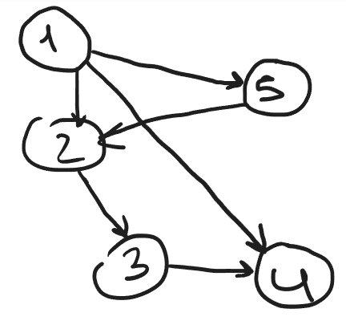

# Оглавление

1. [Лекция 1](#лекция-1)
2. [Лекция 2](#лекция-2)
3. [Лекция 3](#лекция-3)
4. [Лекция 4](#лекция-4)
5. [Лекция 5](#лекция-5)
6. [Лекция 6](#лекция-6)
7. [Лекция 7](#лекция-7)
8. [Лекция 8](#лекция-8)
9. [Лекция 9](#лекция-9)
10. [Лекция 10](#лекция-10)
11. [Лекция 11](#лекция-11)
12. [Без номера](#без-номера)
13. [Последняя](#последняя)
14. [Ссылки](#ссылки)
15. [Внимание, анекдот!](#внимание-анекдот)
---

# <a name="лекция-1">Лекция 1</a>

## Задача, стоящая перед нами

Взять Maven или Gradle, сделать простой проект, делающий что-то и тесты к нему. Задача должна быть вычислительно сложной. Время работы от 3 до 10 сек. Примеры: вычисление площади под графиком

**Дополнение**:  
*Для таких проектов часто удобно использовать плагины для автоматического тестирования и профилирования — например, Surefire и Jacoco в Maven, чтобы проверить корректность и производительность.*

---

## Параллельные вычисления и многопоточное программирование

**Параллельные вычисления** позволяют выполнять несколько задач одновременно, что сокращает общее время выполнения программы. **Многопоточное программирование** — это подход, при котором в рамках одного процесса создаются несколько потоков для выполнения различных задач.

Преимущества многопоточного программирования:
- Улучшение производительности на многопроцессорных системах.
- Реализация более отзывчивых программ (например, GUI).
- Эффективное использование ресурсов процессора.

Основные вызовы:
- Потокобезопасность.
- Сложность отладки.
- Переключение контекста, которое может увеличивать накладные расходы.

**Дополнение**:  
*В Java для безопасного доступа к разделяемым ресурсам используют синхронизированные блоки, объекты `Lock` (из пакета `java.util.concurrent.locks`), а также атомарные переменные (`AtomicInteger`, `AtomicLong` и др.).*

---

## Архитектура параллельных вычислительных систем

Современные вычислительные системы имеют архитектуры, оптимизированные для параллельных вычислений:
1. **Многоядерные процессоры**:
   - Несколько ядер в одном процессоре.
   - Поддерживают аппаратную многопоточность.
2. **Системы с разделяемой памятью**:
   - Общая память для всех процессоров.
   - Требуется синхронизация доступа.
3. **Распределенные системы**:
   - Несколько узлов соединены сетью.
   - Каждый узел имеет свою локальную память.
4. **Графические процессоры (GPU)**:
   - Оптимизированы для массово параллельных вычислений.
   - Используются в машинном обучении и компьютерной графике.
5. **Кластерные системы**:
   - Объединение множества серверов для работы как одного суперкомпьютера.
   - Используют MPI или другие протоколы для связи между узлами.

Архитектура выбирается в зависимости от типа задач и уровня параллелизма, который требуется достичь.

**Дополнение**:  
*Для некоторых типов задач (например, машинное обучение) удобнее использовать гибридные архитектуры, где сочетаются CPU и GPU (так называемые heterogeneous computing).*

---

# <a name="лекция-2">Лекция 2</a>

## Цель распараллеливания

Основная цель распараллеливания — это минимизация времени выполнения задач за счет их распределения на несколько процессоров или ядер. Это достигается путем:
- Разделения задач на независимые части.
- Одновременного выполнения нескольких частей задачи.

**Дополнение**:  
*При проектировании параллельного алгоритма важно учесть масштабируемость: как быстро увеличивается производительность при добавлении новых ядер/процессоров.*

---

## Минимум времени выполнения работ

Эффективное распараллеливание позволяет:
- Уменьшить общее время выполнения программы.
- Снизить задержки при выполнении долгих операций.
- Увеличить пропускную способность системы.

---
 - Статическое планирование - заранее продумываем план и реализацию.
 - Динамическое планирование - продумываем в процессе работы системы.
---

**Дополнение**:  
*При динамическом планировании можно использовать планировщики (schedulers) или средства типа «work-stealing» (в `ForkJoinPool`), чтобы равномернее распределять нагрузку.*

---

## Классификация ЭВМ

Классификация Флинна, основанная на том, как устроена в компьютере обработка данных. Согласно этой классификации все компьютеры (вычислительные комплексы) можно разделить на четыре класса - компьютеры с архитектурой:

- SISD (Single Instruction stream - Single Data stream) - одиночный поток команд - одиночный поток данных. К этому классу относятся обычные "последовательные" компьютеры с фон-Неймановской архитектурой, когда команды программы выполняются последовательно, обрабатывая очередной элемент данных.
- SIMD (Single Instruction stream - Multiple Data stream) - одиночный поток команд - множественный поток данных. К этому типу относятся компьютеры с векторными и матричными процессорами.
- MISD (Multiple Instruction stream - Single Data stream) - множественный поток команд - одиночный поток данных. К этому типу можно отнести компьютеры с конвейерным типом обработки данных. Однако, многие полагают, что такие компьютеры следует относить к первому типу, а компьютеры класса MISD пока не созданы.
- MIMD (Multiple Instruction stream - Multiple Data stream) - множественный поток команд - множественный поток данных. Класс MIMD чрезвычайно широк и в настоящее время в него попадают многие компьютеры достаточно разной архитектуры. Поэтому предлагаются другие классификации, позволяющие более точно классифицировать компьютеры, входящие в класс MIMD.

**Дополнение**:  
*В реальных системах MIMD часто сочетается с векторными инструкциями (SIMD), поэтому процессор может быть одновременно и «MIMD+SIMD».*

---

## Коэффициент полезной загрузки

Коэффициент полезной загрузки вычислительной системы показывает, насколько эффективно используются ресурсы. Высокий коэффициент достигается при равномерном распределении задач между всеми доступными ядрами/процессорами.



Критический путь 1 -> 5 -> 2 -> 3 -> 4.

$T_i$ - время выполнения одной задачи. $T_{oi} = \sum_{i=0}^{n} T_i$  - общее время выполнения для одного процесора

$T_{o1} = 5$, $T_{o2} = 4$

$\dfrac{T_{o1}}{T_{o2}} = 1,25$ - Ускорение

$K_з = \dfrac{4 + 1}{4 * 2} = \dfrac{5}{8} = 0, 625$ - коэффициент загрузки

**Дополнение**:  
*Иногда полезно анализировать граф зависимостей (DAG) задач, чтобы максимально эффективно распараллелить вычисления и увеличить коэффициент полезной загрузки.*

---

## Два уровня распараллеливания: по данным и по управлению

1. **Распараллеливание по данным**:
   - Задача разбивается на подзадачи, каждая из которых работает с отдельным набором данных.
   - Примеры: обработка массивов, параллельные вычисления в графике.
2. **Распараллеливание по управлению**:
   - Задача разбивается на подзадачи, каждая из которых выполняет свою логику.
   - Примеры: параллельная обработка запросов, многопоточная загрузка данных.

Эти два подхода могут сочетаться для достижения максимальной производительности.

**Дополнение**:  
*Часто распараллеливание по данным применяется при аналитических операциях над большими массивами (Big Data), а по управлению — в серверных приложениях, обрабатывающих множество независимых запросов.*

---

**Класс Thread** - поток в Java. Интерфейс `Runnable` - имеет метод `run()`.

**Thread** - получает объект `Runnable` и вызывает метод `run()`. Поток завершает работу, когда завершает работу метод `run()`.

Метод `start()` создает поток в ОС

**Дополнение**:  
*Создавать потоки напрямую удобно для простых сценариев. Для более сложных задач зачастую лучше использовать «thread pools», чтобы избежать постоянного создания новых потоков.*

---

# <a name="лекция-3">Лекция 3</a>

## Процессы: владелец ресурсов

**Процесс** в ОС — это выполняющаяся программа, обладающая собственным адресным пространством, открытыми файлами (дескрипторами), сетевыми соединениями и другими системными ресурсами. Процесс изолирован от других процессов для безопасности и стабильности системы.  

- В большинстве систем у каждого процесса есть **уникальный идентификатор процесса (PID)**.  
- Процесс может состоять из одного или нескольких **потоков**.  
- В отличие от потоков, процессы взаимодействуют друг с другом через механизмы межпроцессного взаимодействия (IPC) — сокеты, каналы, очереди сообщений и т.д.

Вся память, вычделенная во время работы процесса, принадлежит этому процессу

**Дополнение**:  
*В некоторых ОС есть механизмы «разделяемой памяти» (shared memory), позволяющие нескольким процессам совместно использовать определённые области памяти для более быстрого взаимодействия.*

---

## Потоки и стратегия управления ЦПУ

**Поток** (thread) — это "легковесный" поток управления внутри процесса. Все потоки одного процесса разделяют общее адресное пространство и общие ресурсы. В контексте Java потоки создаются с помощью класса `Thread` или через механизмы более высокоуровневой абстракции (например, `ExecutorService`, `ForkJoinPool` и т.д.).

Потокам выделяется процессорное время и они имеею только его.

**Дополнение**:  
*ОС обычно использует приоритеты потоков и алгоритмы планирования (Round Robin, Priority Scheduling и др.) для распределения процессорного времени.*

---

## Закон Мура

Закон Мура (исторически сформулированный Горденом Муром) предсказывал экспоненциальный рост количества транзисторов на кристалле примерно каждые 18-24 месяца. Однако в последнее время упираемся в физические ограничения, рост стал замедляться, что приводит к стратегии увеличения числа ядер, а не только частоты процессора. Именно поэтому многопоточность и распараллеливание приобретают все большее значение.

**Дополнение**:  
*Новые тенденции включают также трёхмерную компоновку полупроводников (3D-stacking) и специализацию чипов (ASIC, FPGA) для определённых типов задач.*

---

## Стратегии управления памятью

### Виртуальная память

Виртуальная память — это механизм, позволяющий создать для каждого процесса **абстракцию** непрерывного адресного пространства. Физическая память (ОЗУ) обычно меньше совокупного объема виртуальной памяти всех процессов, поэтому ОС может временно выгружать (swapping/paging) неиспользуемые части (страницы) памяти на диск (в файл подкачки) и подгружать их при необходимости обратно.

**Дополнение**:  
*Чрезмерная активность подкачки (thrashing) может существенно замедлить систему, поэтому важно следить за объёмом используемой памяти.*

---

### Physical Address Extension (PAE)

PAE (Physical Address Extension) — технология, позволяющая 32-битным процессорам адресовать больше 4 ГБ оперативной памяти (до 64 ГБ). В современных 64-битных системах поддержка больших объёмов оперативной памяти уже встроена на уровне архитектуры.

**Дополнение**:  
*При работе со старыми системами иногда приходится вручную включать поддержку PAE в настройках ОС (например, в некоторых версиях Linux).*

---

### Множество потоков

Многопоточность позволяет одной программе более эффективно использовать ресурсы многоядерных/многопроцессорных систем. Некоторые преимущества многопоточности:

- Параллельное выполнение независимых задач.
- Более быстрая реакция GUI-приложения (например, выделение фоновых потоков для долгих операций).
- Упрощение структуры программы, когда разные задачи ведут себя как отдельные потоки (например, серверные приложения).

**Дополнение**:  
*Однако следует учитывать гонки данных (race conditions) и мертвые блокировки (deadlocks), и применять правильные механизмы синхронизации.*

---

Daemon thread (Демон-потоки) - потоки в Java, не учавствующие в завершении программы. `setDaemon()` - делает поток фоновым.

Механизм прерываний реализован с использованием внутреннего флага, известного как *статус прерывания* . Вызов `Thread.interrupt` устанавливает этот флаг. Когда поток проверяет прерывание, вызывая статический метод `Thread.interrupted`, статус прерывания очищается. Нестатический `isInterrupted` метод, который используется одним потоком для запроса статуса прерывания другого, не изменяет флаг статуса прерывания.

По соглашению, любой метод, который завершается, выдавая , `InterruptedException` очищает статус прерывания, когда он это делает. Однако всегда возможно, что статус прерывания будет немедленно установлен снова другим потоком, вызывающим `interrupt`.

**Дополнение**:  
*При написании многопоточного кода всегда следует корректно обрабатывать прерывания, особенно в долгих циклах или блокирующих операциях (I/O, `sleep()`, `wait()`).*

Ниже приведён ваш исходный текст с небольшими **вставками** (курсивом), которые расширяют тему, не меняя ваши формулировки и структуру.

---

# <a name="лекция-4">Лекция 4</a>

## Циклы: инициализация, тело, обработка результатов. Тело без побочных эффектов. Рекурсия

Любой цикл обычно состоит из:
- Инициализации (подготовка параметров, переменных и т. п.),
- Тела цикла (основные действия),
- Обработки результатов (суммирование частичных результатов и т. д.).

Чтобы эффективно распараллелить цикл, желательно, чтобы его тело было **без побочных эффектов**, то есть не изменяло глобальные переменные и не зависело от общих ресурсов. В таком случае можно легко разделять работу между потоками без сложной синхронизации.

Аналогичное правило действует при рекурсивных вызовах: если каждая рекурсивная ветвь не зависит от остальных, вычисления легко распараллеливаются (например, рекурсивные обходы деревьев, divide-and-conquer алгоритмы).

*Особенно это актуально, если рекурсивно вычисляются элементы, не зависящие друг от друга (как в ряде Тейлора при подсчёте отдельных слагаемых).*

---

## Распараллеливание цикла

Рассмотрим задачу суммирования большого массива чисел. Последовательная реализация может выглядеть так:

```
double sum = 0.0;
for (int i = 0; i < n; i++) {
    sum += arr[i];
}
```

Чтобы распараллелить:
- Создают несколько потоков,
- Каждый поток обрабатывает часть данных (блочно или шагово),
- Собирают частичные суммы в итоговый результат.

Основные приёмы параллельного суммирования:
1. **“Пирамидка” (дерево суммирования)**: сначала потоки вычисляют свои локальные суммы, затем эти суммы объединяются в дереве редукции, уменьшая накладные расходы на синхронизацию.
2. **“Блоки”**: каждый поток получает непрерывный блок массива (например, первый поток считает от 0 до k-1 элемент, второй от k до 2k-1 и т.д.).
3. **Дополнительная память**: вместо общей глобальной переменной sum, которая требует синхронизации, у каждого потока своя локальная переменная. После окончания работы потоков результаты суммируются в одном потоке.

---

## Варианты сегментирования: блочный и шаговый

- **Блочный (block partitioning)**: массив делится на последовательные блоки (например, если n = 1000 и потоков 4, то потоку №1 достаются индексы [0..249], потоку №2 [250..499], и т.д.).
- **Шаговый (cyclic / interleaving)**: поток №1 обрабатывает индексы 0, 4, 8, 12..., поток №2 — 1, 5, 9, 13..., поток №3 — 2, 6, 10, 14..., поток №4 — 3, 7, 11, 15.... Такой подход бывает полезен, если данные сильно «кластеризованы» и хочется распределить нагрузку более равномерно.

---

## Суммирование рядов. Сходимость. Погрешность. Сегментация как переход к сумме конечного ряда

Многие бесконечные ряды (например, ряды для функций $\sin x$, $\ln x$ и т. п.) можно приближённо вычислять, беря лишь первые `N` слагаемых, при этом контролируя погрешность.  

*Чем быстрее убывает абсолютная величина последующих членов, тем меньше `N` нужно. Иногда учитывают остаточный член (оценку хвоста ряда), чтобы гарантировать нужную точность.*  

Чтобы распараллелить вычисление ряда, можно разбивать эти `N` слагаемых между несколькими потоками (аналогично сумме массива). Важно понимать, насколько быстро сходится ряд, чтобы правильно выбрать `N`.

*Если ряд сходится медленно, нужно задействовать больше потоков, но при этом следить за накоплением погрешности при суммировании очень большого количества членов.*

---

## Тригонометрические функции. Ряд Тейлора. Рекуррентные отношения. Эффективность распараллеливания

Тригонометрические и экспоненциальные функции часто вычисляют через ряды Тейлора или рекуррентные формулы:
$$
\sin x = \sum_{k=0}^{\infty} (-1)^k \frac{x^{2k+1}}{(2k+1)!}, 
$$
$$
\cos x = \sum_{k=0}^{\infty} (-1)^k \frac{x^{2k}}{(2k)!},
$$
и так далее.

*Число необходимых членов ряда Тейлора зависит от величины `x` и требуемой точности, поскольку для больших `x` степени $x^{n}$ растут быстрее. Часто применяются приёмы вычисления синуса и косинуса с помощью редукции аргумента (приведения `x` к меньшему интервалу, например, $[-\pi, \pi]$), чтобы улучшить сходимость.*

Для распараллеливания ряда Тейлора применяют тот же принцип: раздать группам потоков различные наборы членов ряда и аккуратно собрать результат. Но часто практичнее использовать высокопроизводительные библиотеки (например, из «math»-пакетов или специализированных библиотек на С/С++ с векторизацией), чем писать собственную распараллеленную реализацию тригонометрии.

Иногда выгоднее использовать **рекуррентные отношения** (например, для вычисления $\sin(x+\Delta)$ через $\sin x$ и $\cos x$, если их можно эффективно распараллелить или векторизовать.


При больших объёмах вычислений такие рекуррентные формулы позволяют сократить операцию возведения в степень и факториалы, что положительно влияет на скорость.  

---
Метод `join` позволяет одному потоку ждать завершения другого. Если `t` это `Thread` объект, поток которого в данный момент выполняется,

`t.join()`;

заставляет текущий поток приостанавливать выполнение до тех пор, пока `t` поток не завершится. Перегрузки `join` позволяют программисту указать период ожидания. Однако, как и в случае с `sleep`, `join` зависит от ОС для синхронизации, поэтому не следует предполагать, что `join` будет ждать ровно столько, сколько вы укажете.

Как и `sleep`, `join` реагирует на прерывание выходом с `InterruptedException`.

---
Публичный статический интерфейс `Thread.UncaughtExceptionHandler`


Интерфейс для обработчиков, вызываемых при внезапном завершении потока из-за неперехваченного исключения. Когда поток собирается завершиться из-за неперехваченного исключения, виртуальная машина `Java` запросит у потока его `UncaughtExceptionHandler` с помощью `Threada.getUncughtExceptionHandler()` и вызовет метод обработчика `uncaughtException`, передав поток и исключение в качестве аргументов. Если поток не имеет своего `UncaughtExceptionHandler` явно установленного, то его объект `ThreadGroup` действует как его `UncaughtExceptionHandler`. Если объект `ThreadGroup` не имеет особых требований для обработки исключения, он может перенаправить вызов обработчику неперехваченных исключений по умолчанию .

# <a name="лекиця-5">Лекция 5</a>

## Вычисление определённого интеграла

Для численного интегрирования 
$$
\int_a^b f(x)\,dx
$$
часто используют:
1. **Метод прямоугольников (метод Римана)**,
2. **Метод трапеций**,
3. **Более сложные методы (Симпсона, Гаусса и т. п.)**.

Чтобы увеличить точность, повышают число разбиений отрезка $[a,b]$. В параллельном варианте:

- Делят исходный отрезок на несколько подотрезков,
- Запускают несколько потоков, каждый считает свою часть интеграла,
- Суммируют все части.

Таким образом, есть два основных способа:

1. Разбить $[a,b]$ на большие блоки (каждому потоку свой блок).  
2. “Шаговая” схема, когда поток № $k$ считает точки $x_i$ с индексами, дающими остаток $k$ по модулю числа потоков.


$$
nF + (n - 1)Q
$$
где:

- $F$ — это условная «стоимость» одного вычисления функции $f(x)$,
- $Q$ — это условная «стоимость» одной операции сложения,
- $n$ — общее число разбиений (или вычислений значений $f(x)$).

При последовательном подсчёте (например, методом прямоугольников) получается, что надо $n$ раз вычислить $f(x)$ (значит, $nF$) и $n - 1$ раз сложить (значит, $(n - 1)Q$). Так и выходит 
$$
nF + (n - 1)Q.
$$

В параллельном случае на $N$ потоков формула
$$
\frac{n}{N}\,F \;+\; \Bigl(\frac{n - 2}{N} + 1\Bigr)Q
$$
отражает **среднюю нагрузку** на один поток, если мы равномерно распределим работу между потоками:

- Каждый поток делает примерно $\frac{n}{N}$ вычислений функции ($\tfrac{n}{N}F$).
- Внутри потока суммирование локальных результатов занимает порядка $\tfrac{n}{N}-1$ операций, а при слиянии (редукции) частичных сумм ещё нужно учесть несколько дополнительных сложений, что «в среднем» даёт 
$$
\Bigl(\tfrac{n - 2}{N} + 1\Bigr)Q.
$$

## Вычисление числа $\pi$

Существует масса способов параллельно вычислять $\pi$. Несколько популярных подходов:

1. **Через $ \arcsin(x)$ или ряды Лейбница**  
   Пример: $\pi = 4 \sum_{k=0}^{\infty} \frac{(-1)^k}{2k+1}$.  
   Как и прежде, достаточно распараллелить сумму ряда.

2. **Определённый интеграл функции круга**  
   $\pi = 4 \int_0^1 \sqrt{1 - x^2}\,dx$.  
   Делим отрезок $[0,1]$ на подотрезки и распараллеливаем вычисление.

3. **Площадь круга как многогранника**  
   Приближаем окружность многоугольником с большим количеством сторон. Чем больше сторон, тем ближе площадь к $\pi \cdot R^2$. Задачу подсчёта вершин и площадей тоже можно распараллелить.

4. **Метод Монте-Карло**  
   Равномерно “бросаем точки” в квадрат $[0,1]\times[0,1]$. Доля точек, попавших внутрь четверти единичного круга, стремится к $\pi/4$. Генерация и подсчёт внутри круга прекрасно распараллеливаются.

5. **Метод интегрирования единичной функции**  
   В квадрате $[0,1]\times[0,1]$ интегрируем индикаторную функцию круга. По сути, это та же идея Монте-Карло, только в других формулировках.

---
`Callable<O>` возвращает результат


`Future` абстрация над задачей представляет собой результат асинхронного вычисления. Предоставляются методы для проверки завершения вычисления, ожидания его завершения и извлечения результата вычисления.

Результат можно извлечь только с помощью метода `get` , когда вычисление завершено, блокируя при необходимости до тех пор, пока оно не будет готово. Отмена выполняется методом `cancel` . Предоставляются дополнительные методы для определения того, завершилась ли задача нормально или была отменена. После завершения вычисления его нельзя отменить. Если вы хотите использовать `Future` для возможности отмены, но не предоставлять пригодный для использования результат, вы можете объявить типы формы `Future<?>`и возвращать `null` как результат базовой задачи.

`.get()` выбрасывает:
 - `CancellationException` - если вычисление было отменено
 - `ExecutionException` - если вычисление вызвало исключение
 - `InterruptedException` - если текущий поток был прерван во время ожидания

`.get(long timeout,
     TimeUnit  unit)` выбрасывает тоже самое, но добавляется:
 - `TimeoutException`- если время ожидания истекло

`.isDone()` - Возвращает true , если эта задача завершена.

`.isCancelled()` - Возвращает значение true , если эта задача была отменена до ее нормального завершения.

`cancel(boolean force)` - Попытки отменить выполнение этой задачи. Эта попытка не удастся, если задача уже завершена, уже отменена или не может быть отменена по какой-либо другой причине. Если попытка успешна и эта задача не была запущена при вызове отмены , эта задача никогда не должна запускаться. Если задача уже запущена, то параметр force определяет, следует ли прерывать поток, выполняющий эту задачу, в попытке остановить задачу.

---
`public class FutureTask<T>`

Отменяемое асинхронное вычисление. Этот класс предоставляет базовую реализацию `Future`, с методами для запуска и отмены вычисления, запроса на завершение вычисления и извлечения результата вычисления. Результат может быть получен только после завершения вычисления; методы get будут блокироваться, если вычисление еще не завершено. После завершения вычисления его нельзя перезапустить или отменить (если только вычисление не вызвано с помощью `runAndReset()`).

A `FutureTask` может быть использован для обертывания объекта `Callable` или `Runnable`. Поскольку `FutureTask` реализует `Runnable`, `FutureTask` может быть передано `Executor` для выполнения.

# <a name="лекция-6">Лекция 6</a>

## Сортировка

Сортировка — одна из ключевых задач в алгоритмической практике
---

### 1. Пузырьковая сортировка (Bubble Sort)

1. **Идея**  
   - Последовательно «пробегаем» по массиву, сравниваем соседние элементы и меняем их местами, если левый больше правого.  
   - За один проход «всплывает» самый большой элемент, а общее число проходов — $n-1$ (где $n$ — длина массива).

2. **Последовательная сложность**  
   - В худшем и среднем случае $\;O(n^2)$.  
   - «Общая вычислительная мощность» (число сравнений/перестановок) порядка $\frac{n(n-1)}{2}$.


---

### 2. Сортировка слиянием (Merge Sort)

1. **Идея**  
   - Рекурсивно делим массив пополам, сортируем каждую половину, а затем «сливаем» два отсортированных подмассива.  
   - При слиянии двух упорядоченных массивов $(k)$ и $(m)$ потребуются $(k+m)$ сравнений/копирований в худшем случае.

2. **Последовательная сложность**  
   - $\;O(n \log n)$ в среднем и в худшем случае.  
   - «Общая вычислительная мощность» — порядка $n \log n$ сравнений и $\,n \log n$ вспомогательных операций копирования.

---

### 3. Чётно-нечётная сортировка (Odd-Even Sort)

1. **Идея**  
   - Алгоритм похоже на пузырьковую сортировку, но на каждом шаге «попарно» обрабатываются либо все чётные индексы с их соседями (чёт-нечёт), либо все нечётные индексы с их соседями (нечёт-чёт).  
   - Меняем элементы местами, если они не в порядке.

2. **Последовательная сложность**  
   - $\;O(n^2)$ в худшем случае.  
   - Фактически это вид «пузырьковой» логики.

---

### 4. Быстрая сортировка (Quick Sort)

1. **Идея**  
   - Выбираем опорный элемент (pivot).  
   - Разделяем (partition) массив на часть с элементами меньше pivot и часть с элементами больше pivot.  
   - Рекурсивно сортируем левую и правую части.

2. **Последовательная сложность**  
   - Средний случай: $\;O(n \log n)$.  
   - Худший случай: $\;O(n^2)$ (если pivot неудачно выбирается каждый раз).  
   - «Общая вычислительная мощность» в среднем ~$2n \log n$ операций сравнения/обмена.


# <a name="лекция-7">Лекция 7</a>

## Мониторы
Монитр - объект, которым единовремменно мождеть владеть только один потокю

Чтобы сделать метод синхронизированным, добавить `synchronized` ключевое слово к его объявлению

Когда поток вызывает метод `wait()` по отношению к объекту, то поток приостанавливается и добавляется в набор ожидания для ожидания, пока какой-либо другой поток не вызовет `notify()` или `notifyAll()` для того же объекта.

Метод `notify()` используется для пробуждения потоков, которые находятся в наборе ожидания монитора определенного объекта. Существует два способа уведомления ожидающих потоков.

- `notify()` → Для всех потоков, ожидающих на wait, метод notify() уведомляет любого из них о необходимости пробуждения произвольно. Выбор того, какой именно поток следует пробуждать, недетерминирован и зависит от JVM.
- `notifyAll()` → Этот метод просто пробуждает все потоки, ожидающие в наборе ожидания. Пробужденные потоки не смогут продолжить работу, пока текущий поток не снимет блокировку с этого объекта. Пробужденные потоки будут конкурировать обычным образом с любыми другими потоками, которые могут активно конкурировать за синхронизацию.


Доступ к кэшу быстрее, поэтому из них считаем. Кэш у каждого ядра свой. Из-за `synchronized` и `volatile` работает медленее, так как каждый раз обращается к оперативке.

Критическая секция - секция алгоритма, которая должна выполняться только в одном потоке в каждый момент времени.


## Семафоры

Почти блокировка, стопор. Обладает счетчикомю. Можно один раз войти и много раз выйти.

`permits` - начальное количество доступных разрешений. Это значение может быть отрицательным, в этом случае выпуски должны произойти до того, как будут предоставлены какие-либо приобретения.
 Каждый `acquire()` блокирует при необходимости, пока разрешение не станет доступным, а затем берет его. Каждый `release()` добавляет разрешение, потенциально освобождая блокирующего приобретателя. Однако фактические объекты разрешений не используются; `Semaphore` просто ведет подсчет доступного числа и действует соответствующим образом.

 Перед получением элемента каждый поток должен получить разрешение от семафора, гарантирующее, что элемент доступен для использования. Когда поток заканчивает работу с элементом, он возвращается обратно в пул, а разрешение возвращается в семафор, позволяя другому потоку получить этот элемент. При `acquire()` вызове не удерживается блокировка синхронизации, поскольку это помешало бы возврату элемента в пул. Семафор инкапсулирует синхронизацию, необходимую для ограничения доступа к пулу, отдельно от любой синхронизации, необходимой для поддержания согласованности самого пула.

 Если установлено значение `false`, этот класс не дает никаких гарантий относительно порядка, в котором потоки получают разрешения. В частности, разрешено вклинивание , то есть вызывающему потоку `acquire()` может быть выделено разрешение раньше потока, который ожидал — логически новый поток помещает себя во главе очереди ожидающих потоков. Если справедливость установлена ​​в `true`, семафор гарантирует, что потоки, вызывающие любой из `acquire` методов, выбираются для получения разрешений в том порядке, в котором был обработан их вызов этих методов (первым пришел — первым вышел; FIFO).

 `tryAcquire ()` Получает разрешение, если таковое имеется, и немедленно возвращает его со значением `true`, уменьшая количество доступных разрешений на одно. Если разрешение отсутствует, то этот метод немедленно вернет значение `false`.

## happens-before 

 - Каждое действие в потоке происходит раньше каждого действия в этом потоке, которое происходит позже в порядке выполнения программы.
 - Разблокировка ( `synchronized` выход из блока или метода) монитора происходит перед каждой последующей блокировкой ( `synchronized` входом из блока или метода) того же монитора. И поскольку отношение происходит-перед является транзитивным, все действия потока до разблокировки происходят перед всеми действиями, следующими за блокировкой любого потока этого монитора.
 - Запись в `volatile` поле происходит перед каждым последующим чтением этого же поля. Записи и чтения `volatile` полей имеют такие же эффекты согласованности памяти, как вход и выход из мониторов, но не влекут за собой блокировку взаимного исключения.
 - Вызов в `start` потоке происходит до любого действия в запущенном потоке.
 - Все действия в потоке происходят до того, как любой другой поток успешно вернется из `join` этого потока.

## Lock

`Lock` — это интерфейс в Java, предоставляющий механизм эксклюзивного или совместного доступа к разделяемому ресурсу. Он расширяет возможности встроенной синхронизации (`synchronized`) за счёт:

- Гибкого управления блокировками (можно вызывать `lock()` и `unlock()` в разных местах кода).
- Поддержки нескольких методов блокировки (прерываемая, с таймаутом и т. д.).
- Возможности использования нескольких объектов `Condition` для одного `Lock`.

Эксклюзиная и неэксклюзивная блокировка

`readLock()`, `writeLock()`
---

### Идиома использования `Lock`

Самая распространённая **идиома** безопасного использования `Lock` в Java основана на конструкции `try/finally`:

```java
Lock lock = ...;
lock.lock();
try {
    // Код, работающий с общим ресурсом,
    // который защищён этой блокировкой
} finally {
    lock.unlock();  // Снятие блокировки, даже если было исключение
}
```

# <a name="лекция-8">Лекция 8</a>

## Гонка данных

P.S. Дополни

Предположим, что есть два процесса A и B, которые выполняются на разных процессорах. Оба процесса пытаются вызвать функцию bankAccount() одновременно. Значение общей переменной, которую мы собираемся передать в функцию, равно 1000.

Рассмотрим, A вызывает функцию bankAccount() и передает значение 200 в качестве параметра. Таким же образом, процесс B также вызывает функцию bankAccount() и передает значение 100 в качестве параметра.

Результат выглядит следующим образом:

- Процесс А загружает 1100 в регистр ЦП.
- Процесс B загрузит 1100 в свой регистр.
- Процесс A добавит 200 в свой регистр, тогда результат будет 1300.
- Процесс B добавит 100 к своему регистру, и вычисленный результат будет равен 1200.
- Процесс A сохранит 1400 в общей переменной, а процесс B сохранит 1150 в общей переменной.

`CountDownLatch` инициализируется с заданным `count`. `await` Методы блокируются до тех пор, пока текущий count не достигнет нуля из-за вызовов метода `countDown()`, после чего все ожидающие потоки освобождаются, а любые последующие вызовы `await` немедленно возвращаются. Это явление одноразовое — счетчик не может быть сброшен. Если вам нужна версия, которая сбрасывает счетчик, рассмотрите возможность использования CyclicBarrier.

`CountDownLatch` — это универсальный инструмент синхронизации, который может использоваться для ряда целей. `CountDownLatch` Инициализированный со счетчиком один служит в качестве простой защелки включения/выключения или шлюза: все вызывающие потоки `await` ждут у шлюза, пока он не будет открыт вызывающим потоком `countDown()`. `CountDownLatch` Инициализированный до `N` может использоваться, чтобы заставить один поток ждать, пока `N` потоков не завершат какое-либо действие или какое-либо действие не будет выполнено `N` раз.

Полезным свойством a `CountDownLatchя` вляется то, что он не требует, чтобы вызывающие потоки countDownждали, пока счетчик достигнет нуля, прежде чем продолжить, он просто не позволяет ни одному потоку продолжить работу после `await` пока не пройдут все потоки.

## Оптимистичная блокировка

Делаем -> Проверяем -> Сработало. Если не срботало -> Откатить

Недостаток: Сложно реализуется

Пример:
```java
p += 100;
d -= 100;
```
Выполняем -> Проверяем. Время последней модификации -> Нормально. оставляем ИЛИ Не нормально. Откатываемся

## Попреждение данных
Hashmap


Таблица с хэш-кодами, в каждой ячейке ссылка на данные (объект или список объектов). В случае параллельных операций над HashMap, возможно повреждение данных.

## Задача об обедающих философах


Каждый философ может либо есть, либо размышлять. Приём пищи не ограничен количеством оставшихся спагетти — подразумевается бесконечный запас. Тем не менее, философ может есть только тогда, когда держит две вилки — взятую справа и слева.

Каждый философ может взять ближайшую вилку (если она доступна) или положить — если он уже держит её. Взятие каждой вилки и возвращение её на стол являются раздельными действиями, которые должны выполняться одно за другим.

Задача Тупика (`Deadlock`)

4 условия возникновения тупика:
1. Круговое (циклическое) ожидание. Решение: брать ресурсы в правильном порядке.
2. Запрос на экслкюзивное владение ресуросом.
3. Удержание и ожидание. Hold and Wait. Решение: Timeout - отдать ресурс через время.
4. Отсутствие возможности отобрать ресурс. Отсутствие приоритета

Способ решения тупиков - игнорирование.

СУБД борется с дедлоками путем убийства одной из транзакции.

## Голодание потоков

Голодание описывает ситуацию, когда поток не может получить регулярный доступ к общим ресурсам и не может добиться прогресса. Это происходит, когда общие ресурсы становятся недоступными на длительные периоды из-за «жадных» потоков. Например, предположим, что объект предоставляет синхронизированный метод, который часто требует много времени для возврата. Если один поток часто вызывает этот метод, другие потоки, которым также требуется частый синхронизированный доступ к тому же объекту, часто будут блокироваться.


# <a name="лекция-9">Лекция 9</a>

## Тестирование многопоточности

TDD (Test Driver Development) - Сначала пишется простой класс с заглушками, потом пишем тесты (с необходимым функционалом), а потом класс дорабатывается до прохождения всех тестов. Тест должен показывать как должен работать класс.

Тесты для всех вариантов использования.

T1 | T2
:---:|:---:
l.countDown()|l.await()
s.acquire()|s.release()
l2.await()| l2.countDown()

## Покрытие кода

Если есть код, который нельзя протестировать, он не нужен. Выполнить тесты 50 раз

Websocket - расширение http с двухсторонней передачей.

# <a name="лекция-10">Лекция 10</a>

Алгоритм банкира - предусмотрение всех возможных ситуаций. Есть ресурс захвата и надо захватить всё, что позволяет избежать тупика.


Берём всё сразу. С импользованием tryLock() и итеративными попытками захватить все (если не все, освобождаем захваченное).

Надежное состояние (всё захвачено, всё свободно). Конечное время выхода - по таймауту. Но! захватываются все данныеЮ даже не применяемые в текущей итерации.

## Структура данных

Почему HashMap не закладывается друг в друга? Ест очень высокая вероятность, что элементы имеют одинаковый хэш.

Для потокобезопасности нужно блокировать части иль весь HashMap.

Можно разделить ConcurrenyHashMap на блоки, используется перебалансировка.

`CopyOnWriteArrayList` - создается копия. Во время перезаписи работает опорный итератор (без изменений). Журнал версий или ссылка на массив.

synchronizedMap, List, Set - метод для оборачивания коллекции в потокобезобасную. работает долго, медленно


# <a name="лекция-11">Лекция 11</a>

## Система массового обслуживания


Event Driver - управляется событиями, реагирует на воздействие снаружи.

Event Source - удобно воспроизводить историю, состоит полностью из событий, расход памяти

Будут идти заявки от клиентов. Достаточно сделать генератор случайных заявок. Либо считывать заявки из файла. Класс СМО (Магазин/Биржа с интерфейсом).
Необходимы тесты. Необходимо сделать слушателя на order. Callback

## Неизменяемые объекты

В конструкторах крайне нежелательно вызывать методы других классов.

Неизменяемые объекты являются потокобезопасныи. Аннотация `@Immutable` не делает класс неизменяемый, а используется при документировании. У класса `Collection` есть методы, которые позволяют создать неизменяеммые обертки для коллекций.

Для `List<Long>` можно использовать копии, в другом случае можно возвращать Collections `unmodifiableList()`. Для `Date` можно в виде `Long`.

# <a name="без-номера">Потерялася я, мама!</a>

## Дисциплина обслуживания

1. FIFO - обслуживание по очереди
2. LIFO - используетсчя редко
3. Обслуживание по приоритету

## OSI
Open System Interconnection (OSI), или модели взаимодействия открытых систем, используется 7 уровней. Каждый из уровней выполняет специфические функции, обеспечивая взаимодействие между сетевыми устройствами:

1. **Физический уровень (Physical Layer)**  
   - Передача данных в виде сигналов по проводным и беспроводным каналам.  
   - Примеры: кабели, разъемы, радиоволны.

2. **Канальный уровень (Data Link Layer)**  
   - Управление доступом к среде передачи и обнаружение ошибок.  
   - Примеры: Ethernet, Wi-Fi.

3. **Сетевой уровень (Network Layer)**  
   - Определение маршрутов и логическая адресация.  
   - Примеры: IP, ICMP.

4. **Транспортный уровень (Transport Layer)**  
   - Надежная доставка данных между устройствами.  
   - Примеры: TCP, UDP.

5. **Сеансовый уровень (Session Layer)**  
   - Управление сеансами связи (установка, поддержание, завершение).  
   - Примеры: SMB, PPTP.

6. **Представительский уровень (Presentation Layer)**  
   - Преобразование, шифрование и сжатие данных.  
   - Примеры: SSL/TLS, JPEG.

7. **Прикладной уровень (Application Layer)**  
   - Интерфейс для взаимодействия приложений и пользователя.  
   - Примеры: HTTP, FTP, DNS.

## Синхронизированные алгоритмы

Классификация:
1. AbstractionFree - точно рассчитает
2. LockFree - не использует блокировки
3. WoitFree - без ожидания

## Callback в Java

**Callback** (обратный вызов) — это метод, который передается как параметр в другой метод и вызывается, когда задача завершена.  
Обычно он используется для обработки результатов асинхронных операций, таких как:
- запросы к серверу,
- операции с файлами,
- долгие вычисления.

### Реализация Callback в Java

В Java обратные вызовы часто реализуются через:
1. **Интерфейсы.**
2. **Лямбда-выражения** (начиная с Java 8).
3. **Анонимные классы.**


### Методы Callback

- **`onSuccess`** — вызывается при успешной обработке задачи. Получает результат операции.  
- **`onError`** — вызывается при возникновении ошибки. Получает объект исключения для обработки.

Consumer - вариант Callback

## Режимы работы Disruptor

**Disruptor** — это кольцевой буфер. Она поддерживает различные режимы ожидания данных:  
1. **BusySpin** — поток активно ожидает данные, не освобождая процессор.  
2. **Yielding** — поток уступает другим потокам, если данные недоступны.  
3. **Sleeping** — поток "засыпает" на короткие интервалы, снижая нагрузку на процессор.  
4. **Blocking** — поток блокируется, ожидая данные, снижая энергопотребление.

Режим **BusySpin** подходит для задач, где минимальная задержка критична, но увеличивает использование процессора. 

Два указателя (Consumer, Producer)
Внутри должны по умолчанию лежать заявки. Может быть реализован при помощи двух очередей. Одна оптимизирована для чтения, другая - под запись.

# <a name="последняя">Последняя</a>

## Распределенные вычислительные системы

Основная проблема - критическая секция. Это элемент, выполняемый строго одним потоком.  
### Правила
- **Безопасность** - строго один поток в критической секции  
- **Живучесть** - время ожидания не бесконечно  

### Варианты решения
1. **Координатор** - управляет критической секцией.  
2. **Временные метки** - получить от всех ответ, что у них временная метка позже.  
3. **Много координаторов** - более отказоустойчивее, чем один, делят систему.  

### Программы и технологии

#### parallelStream
- Имеет собственный threadpool.  

#### CompletableFuture
- **andThen(Consumer<T>)** - костыль.  

#### Reactive Streams  
- **JavaFlow**:  
  - **Publisher** - генерирует события.  
  - **Subscriber** - получатель событий.  
  - **Subscription** - вспомогательный интерфейс.  
  - Взаимодействие:  
    - `Publisher -> subscribe(Subscriber) -> Subscriber.onSubscribe(Subscription)`.  
    - **.cancel()** - отменить подписку.  
    - **.request(n)** - готов к принятию n сообщений (событий).  

#### Akka
- Фреймворк для работы с распределенными системами.  
- Основной элемент: **актор**.  
- Акторы обмениваются сообщениями, что облегчает работу в распределенной среде.  

#### Zookeeper
- Система координации, используется для управления критическими секциями.  
- Поддерживает распределенные блокировки и согласованность.  

#### Hazelcast и Apache Ignite
- Средства распределенной обработки данных.  
- Позволяют реализовывать критические секции и масштабируемость.  

### Дополнительные рекомендации  
- Использование алгоритмов:  
  - **Алгоритм Лампорта** - синхронизация через временные метки.  
  - **Алгоритм Раймана** - оптимизация использования критической секции в распределенных системах.  
  - **Paxos/Raft** - согласованность данных в распределенной среде.  


# <a name="ссылки">Ссылки на ресурсы</a>

 - [Threads](https://docs.oracle.com/javase/8/docs/api/java/lang/Thread.html)
 - _
 - _
 - _
 - _

# <a name="внимание-анекдот">Внимание, анекдот!</a>

## Стишок

По деревне шёл Иван,  
Был мороз скрипучий.  
У Ивана **х@й** стоял —  
Так, на всякий случай.

## Так что же такое UDP и TCP

- Знаю анекдот про UDP, но не факт, что он до вас дойдет...
- А еще знаю анекдот про TCP. Если он до вас не дойдет, я повторю его снова.

## Нюанс

Петька спрашивает у Чапаева: «Василий Иванович, а что такое нюанс?»
Чапаев:
— Снимай штаны, Петька, покажу.
Петька в некотором недоумении снимает штаны.
Чапаев подходит сзади и засовывает ему понятно что, понятно куда, и объясняет:
— Вот смотри, Петька, — вроде и у тебя х@й в жопе, и у меня х@й в жопе… Но! Есть один нюанс…